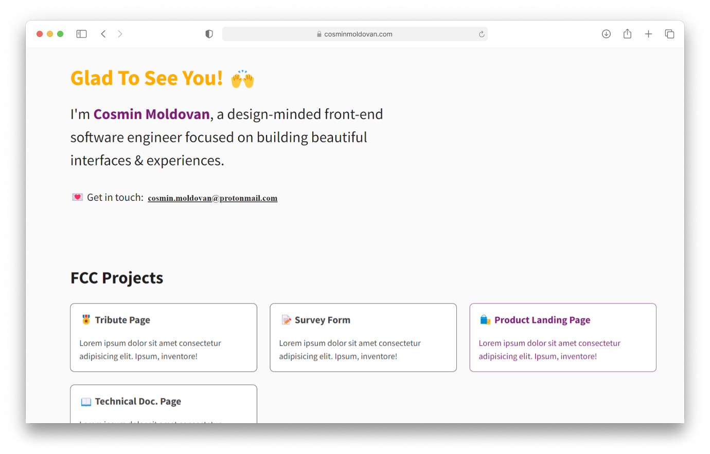

# 🧑‍💻 freeCodeCamp Personal Portfolio Webpage
**Project within:** Responsive Web Design Certification by Free Code Camp <a href="https://www.freecodecamp.org/learn/responsive-web-design/responsive-web-design-projects/build-a-product-landing-page/">View Certification</a>

**Objective:** Build your own personal portfolio page.

**Requirements:** <a href="https://www.freecodecamp.org/learn/2022/responsive-web-design/build-a-personal-portfolio-webpage-project/build-a-personal-portfolio-webpage">View Requirements</a>

**Solution Link:** <a href="https://cosminmoldovan.github.io/fcc-personal-portfolio-webpage/">See Live</a>

